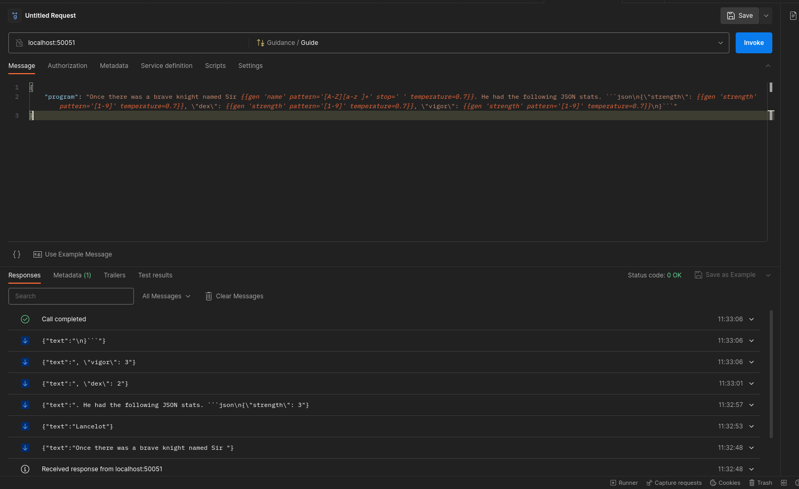

# GuidanceRPC



A very simple server to run guidance programs over http.

Supports health checking and reflection.

## Goals

Run [guidance](https://github.com/guidance-ai/guidance) programs over http in a reliable and performant way.

- [x] Run simple programs consisting of `gen` + prompt text
- [x] Streaming
- [ ] Logging (no idea why this is not working.)
- [ ] Error handling
- [ ] Guidance programs with `async` steps

## Non-Goals

- Support non-hugging-face models (including openai)
- Support windows (use wsl/docker/podman)
- CPU support (fixes going this direction are fine, it should not add complexity)

## Acceptable Contributions

- Improving my awful python
- Inprove Dockerfile
- Add docker examples
- Bug fixes
- Documentation
- Tests
- Performance improvements (startup speed on larger models is a big one)
- Increasing the number of guidance programs that can be run

## Running

### Quickstart

```bash
podman run -e MODEL_NAME=gpt2 -p 50051:50051 --init --device=nvidia.com/gpu=all ghcr.io/utilityai/guidance-rpc:latest
```

### Locally

Required [poetry](https://python-poetry.org/) to be installed.

```bash
poetry install
poetry run python src/main.py
```

### Podman / Docker

This should work almost 1-1 with docker
- the `device` flag in `run` may be different
- the suffix `,z` on the `--mount` will not be required

#### Latest Release

```bash
podman run \
  -p 50051:50051 \
  -e MODEL_NAME=meta-llama/Llama-2-7b-hf \
  -e HF_TOKEN=hf_aaaaaaaaaaaaaaaaaaaaaaaaaa \
  --mount type=bind,src=$XDG_CONFIG_HOME/.cache/huggingface,dst=/root/.cache/huggingface,z \
  --init \
  --device=nvidia.com/gpu=all \
  ghcr.io/utilityai/guidance-rpc:latest
```

#### From source

```bash
podman build -t guidance-rpc .
```

```bash
podman run \
  -p 50051:50051 \
  -e MODEL_NAME=TheBloke/Llama-2-7b-Chat-GPTQ \
  -e CACHE=False \
  --mount type=bind,src=$HOME/.cache/huggingface,dst=/root/.cache/huggingface,z \
  --init \
  --device=nvidia.com/gpu=all \
  guidance-rpc
```

## Contributing

See Acceptable Contributions and Non-Goals above.

___
Generate grpc files with

```bash
python -m grpc_tools.protoc -I protos --python_out=src --pyi_out=src --grpc_python_out=src protos/guidance.proto
```
___
If you update dependencies, run

```bash
poetry update
```

and then

```bash
poetry export -f requirements.txt --output requirements.txt
```
